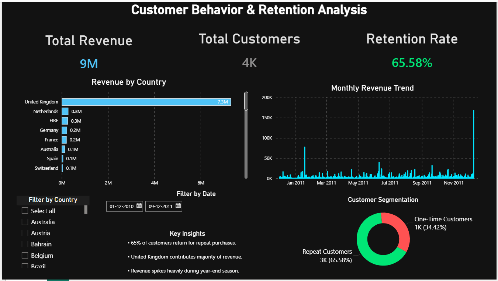

# 📌 Customer Behavior & Retention Analysis Dashboard

## 🔍 Problem Statement

Businesses often struggle to understand customer purchasing behavior, customer loyalty, and revenue contribution patterns. Without retention analysis, companies may lose valuable repeat customers and fail to identify seasonal revenue opportunities.

This project analyzes customer behavior and retention patterns to help businesses improve customer engagement, optimize retention strategies, and identify high-performing markets.

---

## 🎯 Business Objective

The objective of this project is to:

- Analyze customer retention behavior
- Identify repeat vs one-time customers
- Track revenue trends over time
- Understand country-wise revenue contribution
- Provide actionable business insights for customer retention improvement

---

## 📊 Dataset Information

- Dataset: Online Retail Dataset
- Domain: E-Commerce / Retail Analytics

### Key Fields:
- Customer ID
- Invoice Date
- Country
- Revenue
- Quantity
- Product Details

---

## 🧹 Data Cleaning & Transformation (Power Query)

- Removed null customer IDs
- Corrected data types
- Removed duplicate records
- Standardized column names
- Filtered invalid transactions

---

## 📐 DAX Measures & Analytical Logic

### DAX Concepts Used:
- CALCULATE
- FILTER
- DISTINCTCOUNT
- DIVIDE
- SUMMARIZE

### Key Measures Created:
- Total Revenue
- Total Customers
- Retention Rate
- Repeat Customers
- One-Time Customers

---

## 📊 Dashboard Features

### KPI Cards
- Total Revenue
- Total Customers
- Retention Rate

### Visual Analysis
- Revenue by Country
- Monthly Revenue Trend
- Customer Segmentation Analysis

### Interactive Features
- Country slicer
- Date slicer
- Dynamic filtering

---

## 📷 Dashboard Preview

---

## 💡 Key Business Insights

- Around 66% customers are repeat customers
- United Kingdom contributes majority of revenue
- Revenue spikes during year-end season
- Repeat customers drive major business revenue

---

## ✅ Conclusion

The dashboard helps businesses understand customer retention behavior, identify high-performing markets, and improve decision-making using customer analytics.

---

## 🚀 Future Improvements

- Customer Lifetime Value (CLV)
- Churn Prediction
- RFM Segmentation
- Predictive Analytics

---

## 🛠 Tools Used

- Power BI
- Power Query (Data Cleaning & Transformation)
- DAX (Measures & Analytical Calculations)

---

## 📌 Dashboard Access

Download the `.pbix` file from this repository and open using Power BI Desktop.
